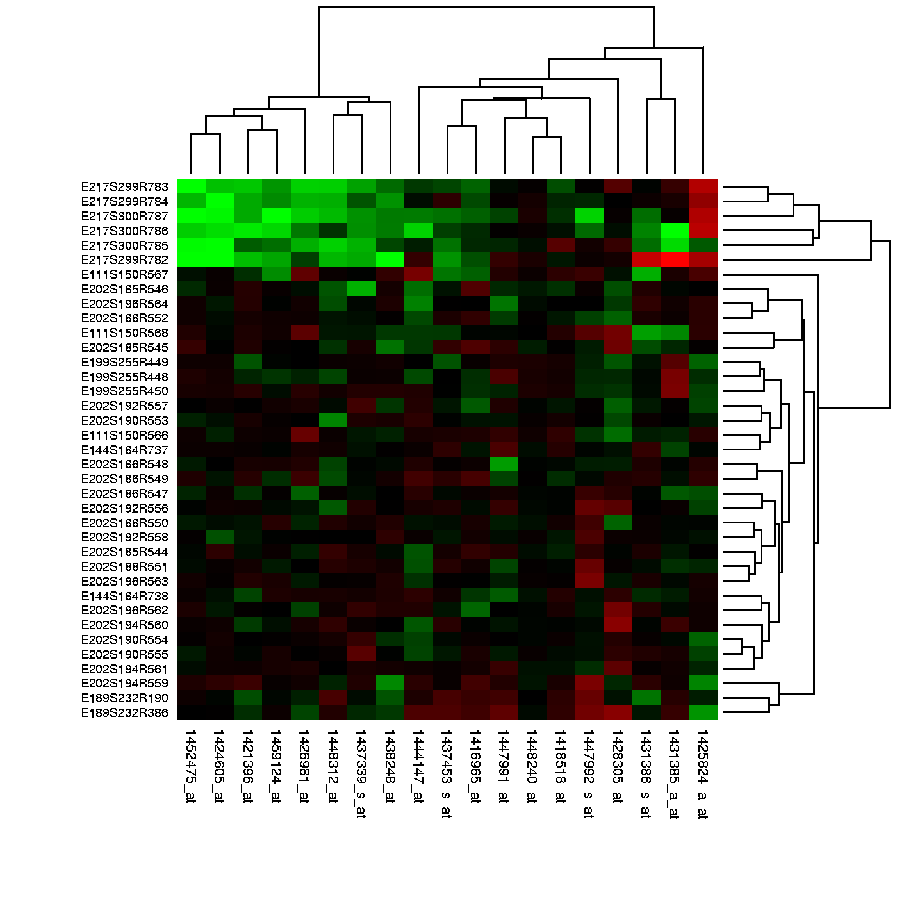

```{r, load_refs, include=FALSE, cache=FALSE}
library(RefManageR)
BibOptions(check.entries = FALSE,
           bib.style = "authoryear",
           cite.style = "alphabetic",
           style = "markdown",
           hyperlink = FALSE,
           dashed = FALSE)
bib <- ReadBib("mmd.bib", check = FALSE)
```


## Motivation: Modern Biology

- Inferences from high-dimensional biological data routinely depend on detecting differences in sample statistics between subjects in two or more classes  
- While analysis may proceed through dimension reduction, we might enhance statistical power to detect true differences when we leverage the true multivariate nature of the data  
- Maximum mean discrepancy is a new method for identifying differences in two high-dimensional distributions

```{r, echo = FALSE, out.height=300, out.width=400}

```


---

## Maximum Mean Discrepancy: What is it? 

- Statistical method for inferring whether two samples have distinct underlying distributions, $P$ and $Q$ `r Citep(bib, "gretton2012kernel")`

- Idea: 
    - Find a smooth function that has large values on points from $P$ and small values on points from $Q$
    - Test statistic is the difference between the mean function values on the two samples
    - Large values of the test statistic provide evidence of $P \neq Q$
    
---

## Formal definition

$$MMD(\mathcal{F}, P, Q) = \sup_{f \in \mathcal{F}}\left( \mathbb{E}_Pf(X) - \mathbb{E}_Qf(Y)\right)$$

Biased empirical estimate:

$$\sup_{f\in \mathcal{F}}\left( \frac{1}{m}\sum_{i = 1}^mf(x_i) - \frac{1}{n}\sum_{i = 1}^n f(y_i)\right)$$

- $\mathcal{F}$ is the unit ball in a universal RKHS
    - universal: dense in the space of bounded continuous functions

---

class: inverse, center, middle


## MMD: Properties


---

## MMD Existence in RKHS, $\mathcal{H}$ `r Citep(bib, "gretton2012kernel")`

*Lemma 3*: If $k(\cdot, \cdot)$ is measurable and $\mathbb{E}_x \sqrt{k(x,x)} < \infty$ then mean embedding of $P$, termed $\mu_p$, is in the RKHS

*Proof*: 

- Define linear operator, $T_pf = \mathbb{E}_xf$ for all $f \in \mathcal{F}$
- By assumption, $T_pf$ bounded, since

$$|T_pf| = |\mathbb{E}_xf| \le \mathbb{E}_x|f| =  \mathbb{E}_x |\langle f, \phi(x) \rangle_{\mathcal{H}}| \le \mathbb{E}_x \left( \sqrt{k(x, x)}||f||_{\mathcal{H}}\right)$$
- Apply Riesz representation theorem to see that there is a $\mu_p \in \mathcal{H}$ with $T_pf = \langle f, \mu_p \rangle_{\mathcal{H}}$ 

- Set $f = \phi(t) = k(t, \cdot)$ to get $\mu_p(t) = \langle \mu_p, k(t, \cdot)\rangle_{\mathcal{H}} = \mathbb{E}_xk(t, x)$

- Mean embedding of $p$ is the expectation under $p$ of the canonical feature map


---

## MMD as a metric

- MMD is a metric on Borel probability measures when $\mathcal{H}$ is a *universal* RKHS defined on a compact metric space $\mathcal{X}$  
  - $k(\cdot, \cdot)$ continuous  
  - $\mathcal{H}$ dense in $\mathcal{C}(\mathcal{X})$ with respect to $L_{\infty}$ norm 

---

class: inverse, center, middle

## Software for MMD


---


## Matlab code 

- Gretton shares matlab code on his site: http://www.gatsby.ucl.ac.uk/~gretton/mmd/mmd.htm

- 4 methods for calculating test thresholds:  
  - Bootstrap  
  - Fast, consistent test  
  - Moment matching using Pearson curves  
  - Gamma test  
  

---

class: center, inverse, middle

## Biology


---

## Microarray cross-platform comparability `r Citep(bib, "borgwardt2006integrating")`

- Two breast cancer data sets on different microarray platforms  
- 2166 common genes  

- Question: Can we use MMD to identify differences in the microarray results? 

---

## Results `r Citep(bib, "borgwardt2006integrating")`

```{r, echo = FALSE}
library(magrittr)
tibble::tibble(platform = c("same", "same", "different", "different"), 
               null_hypothesis = c("accepted", "rejected", "accepted", "rejected"),
               MMD = c(100, 0, 0, 100), 
               t_test = c(100, 0, 95, 5), 
               wolfowitz = c(93, 7, 0, 100),
               smirnov = c(95, 5, 29, 71)) %>%
  knitr::kable()
```

---

## Cancer diagnosis `r Citep(bib, "borgwardt2006integrating")`

Can we distinguish normal from tumor tissues with gene expression data from a prostate cancer study? 

- Use gene expression profiles from healthy patients and patients with prostate cancer  


---

## Results

```{r, echo = FALSE}
tibble::tibble(health_status = c("same", "same", "different", "different"), 
               null_hypothesis = c("accepted", "rejected", "accepted", "rejected"),
               MMD = c(100, 0, 0, 100), 
               t_test = c(100, 0, 100, 0), 
               wolfowitz = c(97, 3, 0, 100),
               smirnov = c(98, 2, 38, 62)) %>%
  knitr::kable()
```


---

## References

```{r refs, echo=FALSE, results="asis"}
PrintBibliography(bib)
```


---

class: center, middle

# Thank you!

Slides created via the R package [**xaringan**](https://github.com/yihui/xaringan).

